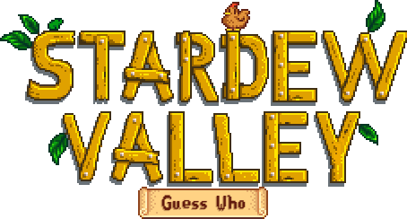

# Stardew Valley Guess Who 🎮

**Stardew Valley Guess Who** is an interactive browser-based game inspired by the classic "Guess Who?" but with a Stardew Valley twist! Explore various characters from the game, narrow down guesses, and uncover hidden secrets. This project is designed by **Matt Rust** and available online for everyone to enjoy.

Play it here: [Stardew Valley Guess Who](https://stardew-guess-who.mattrust.net)

---

## Features ✨

- **Guessing Grid**: Interact with characters by clicking to dim or slash them out, making it easier to narrow down your guesses.

- **Random Character Selector**: Click the random character button to get a randomly chosen Stardew Valley character.

- **Secrets to Uncover**: Discover hidden secrets with special in-game clicks! The way ConcernedApe intended.

---

## How to Play 🎮

1. **Start the Game**: [Go to Stardew Valley Guess Who](https://stardew-guess-who.mattrust.net) to begin.
2. **Navigate Characters**: Use the **Next** or **Previous** buttons to scroll through the available characters or hit the **Random Character** button for a surprise.
3. **Make Your Guess**: Click on any character to knock them out as you narrow down your guesses.
4. **Reset the Game**: Hit the reset button to start fresh at any time.

---

## License 📜

This project is for personal and educational purposes and is not affiliated with or endorsed by **ConcernedApe**, the creator of Stardew Valley. All characters and associated content belong to their respective owners.

---

## Acknowledgments 🙏

- **ConcernedApe** for the incredible world of Stardew Valley.
- Special thanks to everyone who plays the game!

---

Play Now: [Stardew Valley Guess Who](https://stardew-guess-who.mattrust.net) 🌾
